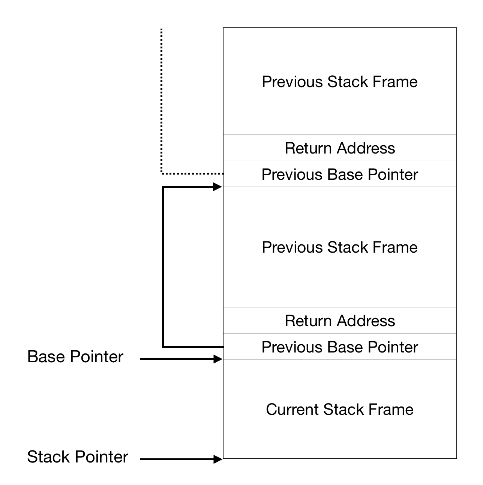

# A stack trace for your OS
## What?
A stack trace displays the location of every function call, 
leading up to when the stack trace itself is called. Essentially, it
tells you the path your code took.

## Why?
A stack trace is incredibly helpful for debugging purposes as
there can be multiple paths to a function call. It is important
to determine which path caused a function call.

## Where?
In exampleOS we automatically print a stack trace whenever the
kernel panics.

## How?
There are two ways debuggers print a stack trace. They can either
parse the [DWARF](http://www.dwarfstd.org) debugging format which
is produced by the compiler, or they can "walk the stack" by
following the stack base pointers. exampleOS uses the latter method
as it is far simpler and works without loading the kernel
symbols. This allows us to produce a stack trace even in the very
early stages of the kernel booting process.

## The call instruction
Functions are called using the assembly call instruction:
```asm
call a_function
```
`a_function` is replaced by the address of the the function during
the linking stage. More importantly, is how the call instruction works.

When the processor reaches the call instruction, it saves the current
instruction pointer onto the stack. This is called a "return address". 
This is so it knows where to continue once the called function has returned.
We use this later to print the location of the function call. When 
the called function returns, the processor examines the stack, 
pops off the return address, and jumps to the return address.

## The frame pointer
Compilers have an option to add frame pointers to every function. When
frame pointers are enabled, two important assembly instructions are
inserted at the start of every function:
```asm
push rbp
mov rbp, rsp
```
This is what the stack looks like when a function is called:  



From the diagram, we can see that the return address is always above the
address stored in `rbp`. So, in order to find the last function's
return address, we just minus 8 (because registers have a size of 8 bytes in 
long mode) from the address stored in `rbp`.

## Enabling frame pointers
The Rust compiler has a flag to enable frame pointers:  
`RUSTFLAGS=-Cforce-frame-pointers=yes`  
This is referenced in the compiler source [here](https://github.com/rust-lang/rust/blob/01a9b30c332810ad0c570e8fed91f956417dec3a/src/librustc/session/mod.rs#L667).

For C and C++ compilers, the search term is `no-omit-frame-pointer`.

## The code
You can see exampleOS's full implementation of a stack tracer [here](https://github.com/Techno-coder/example_os/blob/master/kernel/src/debug/stack_trace.rs).

First we have to obtain the contents of the `rbp` register:
```rust
let mut base_pointer: *const usize;
unsafe { asm!("mov rax, rbp" : "={rax}"(base_pointer) ::: "intel") }
```

Then, to get the return address, we increment the pointer and dereference it:  
```rust
let return_address = unsafe { *(base_pointer.offset(1)) } as usize;
println!("Call site: {}", return_address);
```
Note that in Rust, dereferencing a raw pointer is considered unsafe.  

Finally, we need to "walk the stack" and get the return addresses of all
the previous stack frames. To do this, we set the current
base pointer to the previous stack frame's base pointer:  
```rust
base_pointer = unsafe { (*base_pointer) as *const usize };
```
and then we just repeat all the previous code, giving us a nice loop:
```rust
let mut base_pointer: *const usize;
unsafe { asm!("mov rax, rbp" : "={rax}"(base_pointer) ::: "intel") }
loop {
	let return_address = unsafe { *(base_pointer.offset(1)) } as usize;
	println!("Call site: {}", return_address);
	base_pointer = unsafe { (*base_pointer) as *const usize };
}
```

### Isn't this an infinite loop?
That's right, this loop is going to continue forever, until it hits an
invalid memory address. This is because we don't know when the stack ends.
There's a simple solution to this: before we enter the kernel
function, set the return address to zero, and then stop looping when
reaching a return address that is equal to zero.

Here's the relevant file in exampleOS: [boot_entry.asm](https://github.com/Techno-coder/example_os/blob/15a208f51768b3765154d59225f4a6427a22d0ce/kernel/assembly/boot_entry.asm#L72),
specifically, these two lines:

```asm
xor rbp, rbp
push rbp
```

We could shorten this down to just `push 0` but I believe this code makes the
intent clearer.

Now all we have to do is update our loop:
```rust
// ...
while !base_pointer.is_null() {
	// ...
}
```

Put everything into its own function and then you're done!

## Final thoughts
For now, you'll only see numbers in the stack trace. You can use `objdump` to
map these numbers to the assembly code of your kernel. Later on, we'll be able
to load the kernel symbol table and then print out function names. exampleOS's
stack trace implementation does this.

[Back to the root](../docs/index.md)